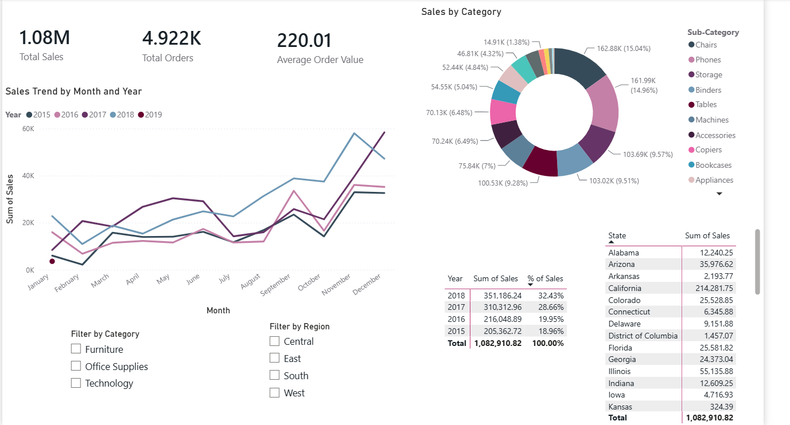
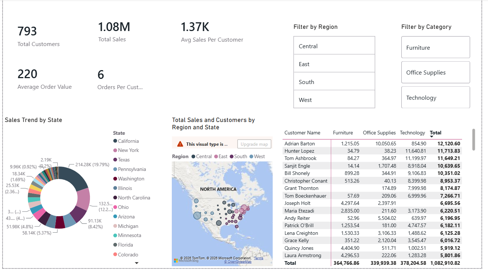
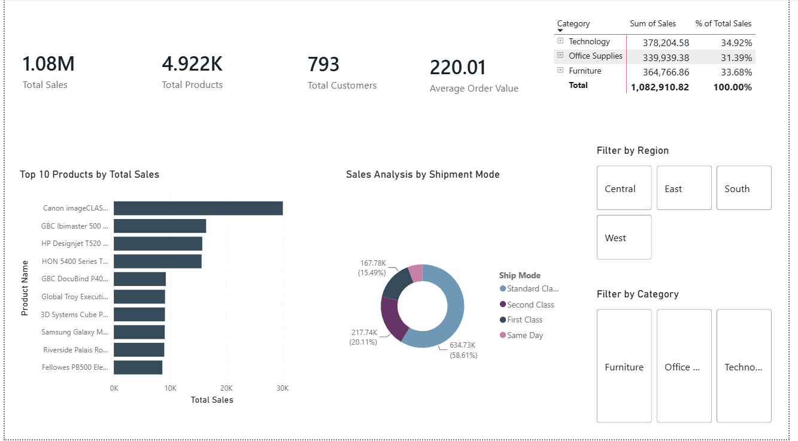
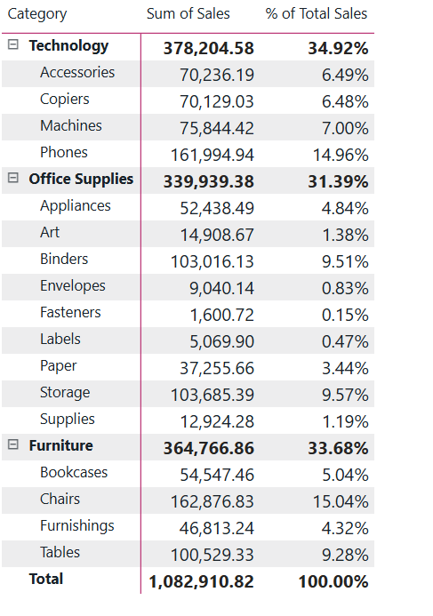
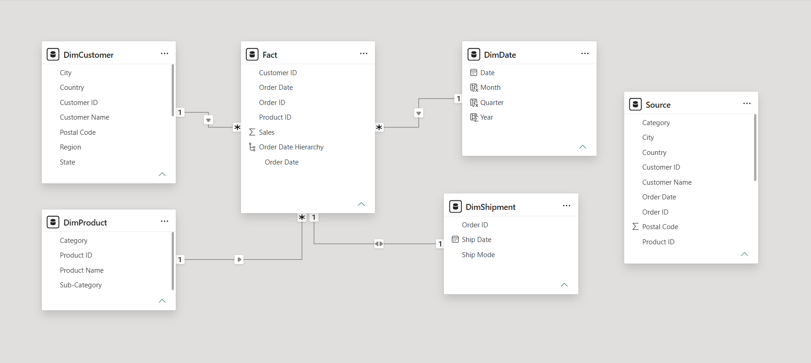

# Sales Analytics Dashboard — Power BI

An end-to-end business intelligence project built in Power BI Desktop, analyzing retail sales data across customers, products, and regions. This project demonstrates the full analytics workflow: data modelling, DAX measure development, and multi-page interactive dashboard design.

---

## Business Questions This Dashboard Answers

- Which regions and states generate the most revenue?
- Which product categories and sub-categories drive the highest sales?
- How does sales performance trend over time?
- Who are the highest-value customers and what is the average spend per customer?
- How does ship mode affect order volume and sales distribution?

---

## Dataset

**Source:** Sample US retail superstore transaction data  
**Scope:** Multi-year sales records across product categories, customer segments, and US states  
**Tables:** 5 structured tables built from raw source data via Power Query

---

## Data Modelling — Star Schema

One of the core decisions in this project was structuring the data into a proper star schema rather than working from a flat file. This involved splitting the raw data into a central Fact table and four Dimension tables, defining one-to-many relationships, and ensuring all measures aggregated correctly across every dimension.

DimCustomer ──(1:)──┐
DimProduct ──(1:)──┤
DimDate ──(1:)──┤── Fact (Sales, Order ID, Customer ID, Product ID, Order Date)
DimShipment ──(1:)──┘


**Key modelling decisions:**
- Moved the Sales column from DimShipment into the Fact table to enable correct aggregation across all dimensions
- Built DimDate separately to support time-based filtering and future time intelligence functions
- Defined inactive relationship between Ship Date and DimDate to support shipping analysis via USERELATIONSHIP

---

## DAX Measures

All measures were written from scratch to support accurate, reusable calculations across every page:

```dax
Total Sales = SUM(Fact[Sales])

Total Orders = DISTINCTCOUNT(Fact[Order ID])

Total Customers = DISTINCTCOUNT(DimCustomer[Customer ID])

Average Order Value = DIVIDE([Total Sales], [Total Orders])

Avg Sales Per Customer = DIVIDE([Total Sales], [Total Customers])

Orders Per Customer = DIVIDE([Total Orders], [Total Customers])
```

---

## Dashboard Pages

### 1. Sales Analysis
High-level revenue overview with time-series trend, regional breakdown, and sub-category performance. Slicers for Region and Category allow cross-filtering across all visuals.

### 2. Customer Analysis
Customer-level metrics including total customers, average spend per customer, geographic distribution via map visual, and state-level sales breakdown. Identifies which regions drive customer volume vs. revenue value.

### 3. Product Analysis
Product and category performance including top products by sales, category/sub-category matrix, and ship mode distribution. Supports decisions on inventory prioritization and product mix.

---

## Key Findings

- The **West region** consistently generates the highest total sales across all product categories
- **Technology** products produce the highest average order value despite lower order volume compared to Office Supplies
- **Standard Class** is the most frequently used shipping mode, accounting for the majority of orders
- A small subset of customers accounts for a disproportionate share of total revenue, indicating high customer concentration

---

## Tools and Techniques

| Area | Tools / Methods |
|---|---|
| Data Transformation | Power Query (M) |
| Data Modelling | Star Schema, Relationships, Cardinality |
| Measures | DAX (SUM, DISTINCTCOUNT, DIVIDE, AVERAGEX) |
| Visualizations | Cards, Line Chart, Bar Chart, Donut Chart, Matrix, Map, Slicers |
| Platform | Power BI Desktop |

---

## How to Use

1. Download `Krish_portfolio.pbix`
2. Open in Power BI Desktop (free download from Microsoft)
3. Use the Region and Category slicers on each page to filter all visuals interactively
4. Navigate between pages using the tabs at the bottom: Sales Analysis, Customer Analysis, Product Analysis

---

## Screenshots

### Sales Analysis


### Customer Analysis


### Product Analysis


### Product Matrix


### Data Model — Star Schema


---

## What I Learned

Building this project end-to-end reinforced how much the data model determines the quality of everything downstream. The most important decision wasn't which visuals to use — it was ensuring Sales lived in the Fact table, relationships were correctly directional, and measures were written to aggregate predictably regardless of which dimension was filtering them. Getting that foundation right made the DAX straightforward and the dashboard reliable.
